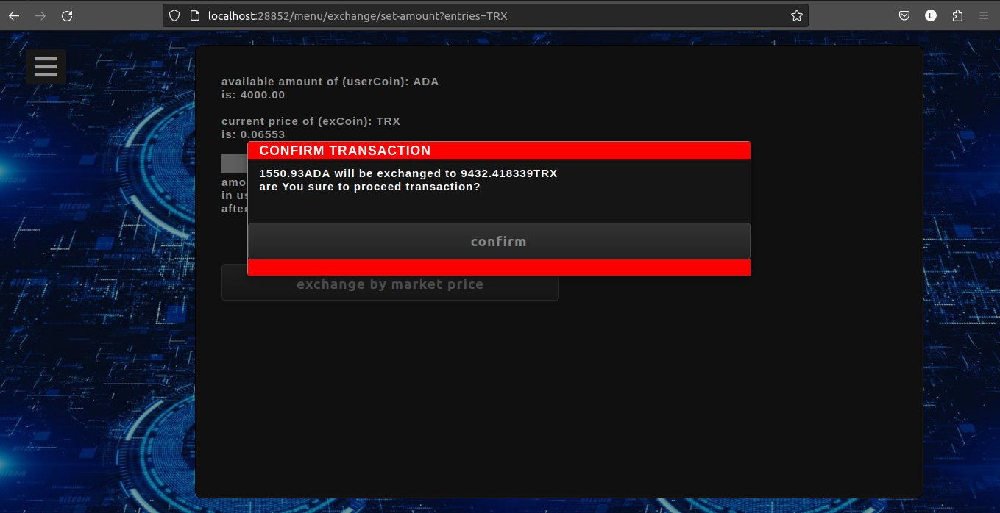

# CoinMarketSupervisor
Repository contains my own educational project named CoinMarketSupervisor.

This application was build for educational purposes. 
It contains key concepts of object oriented programming and layer structured application,
which I have been learning since my first adventure with programming.
The idea was to build some simple backend app, which contains such options like crypto currency wallet 
or displaying market charts. However in this state of application, there is nothing to do with blockchain technology
but it can be expanded in future by adding some options. 

CoinMarketSupervisor simulate private crypto wallet with ability to:
	- create users,
	- transfer funds from external account,
	- exchange funds to 12 popular cryptocurrencies and exchange beetween them,
	- track transactions history,
	- display live charts in 16 intervals,
	- send alerts to Discord bot.

Languages, frameworks and external libraries used in project:

Java 15, 
Javascript, 
HTML, porządny
CSS, 
Gradle, 
Spring Data JPA, 
Spring Security, 
Spring WebFlux, 
Thymeleaf, 
Mockito, 
JUnit, 
H2DataBase, 
IOSocket,
Java Discord Api,
Binance Connector,
Eclipse Jetty Websocket Server.

Here is some screenshots while program is running:
Login:

Home page:

Currently I'm working on discord alerts. Application conects to Discord Bot (package utils.DiscordUtils,
credentials are not visible for obvious reasons), but there is no user interface to set alerts.

In the future I will try to connect this application to my real binance account, not only for updating prices 
how this is now implemented, but also for placeing orders in real coin-market order book.
This is really exciting experience for me as a novice programmer that I can connect to such solid API like
BinanceApi only reading documentation.
